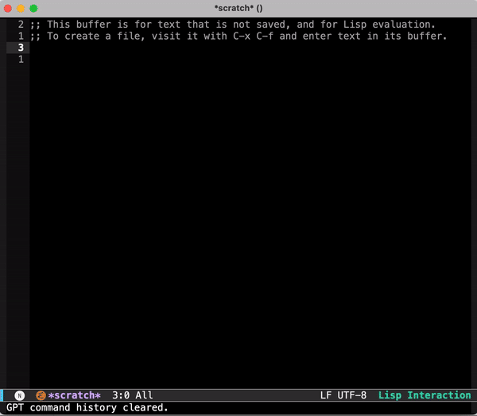
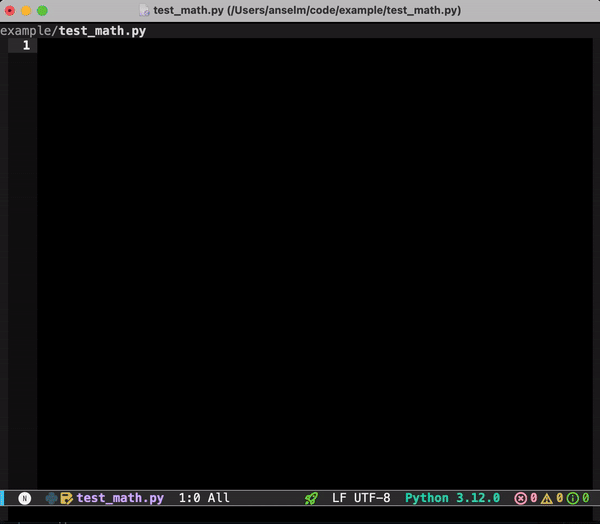

<p align="center">
    
</p>

# le-gpt.el

le-gpt.el is a comprehensive Emacs package for interacting with large language models like GPT-4 and Claude 3.5 Sonnet. It's a feature-rich fork of [gpt.el](https://github.com/stuhlmueller/gpt.el) that adds project awareness, completion, region transform, and more to come.

The aim is to make sure emacs stays up-to-date with modern GPT support. Essentially aiming for a CursorAI for emacs.

## Features

| Chat Interface                                                                   | Completion at point                                                        |
|----------------------------------------------------------------------------------|----------------------------------------------------------------------------|
|                                  |  |
| Create and manage multiple chat sessions                                         | Let GPT complete what you're currently writing                             |
| `M-x le-gpt-chat` & `C-c` to follow-up & `C-t` to generate buffer name using GPT | `M-x le-gpt-complete-at-point`                                             |


| Project Context                                                         | Region Transformation                                             |
|-------------------------------------------------------------------------|-------------------------------------------------------------------|
|      |  |
| Select files from your project that GPT should use as context           | Select a region you want GPT to transform                         |
| `M-x le-gpt-select-project-files` & `M-x le-gpt-deselect-project-files` | `M-x le-gpt-transform-region`                                     |


## Installation

### Prerequisites

You'll need Python packages for the API clients:

```bash
pip install openai anthropic jsonlines
```
You don't need to install all of them, but minimally `openai` or `anthropic`.

You'll also need API keys from [OpenAI](https://beta.openai.com/) and/or [Anthropic](https://console.anthropic.com).

### Using straight with use-package
```elisp
(use-package le-gpt
  :straight (le-gpt :type git
                       :host github
                       :repo "AnselmC/le-gpt.el")
  :bind (("M-C-g" . le-gpt-chat)
         ("M-C-n" . le-gpt-complete-at-point)
         ("M-C-t" . le-gpt-transform-region)
         ("M-C-s" . le-gpt-select-project-files)
         ("M-C-d" . le-gpt-deselect-project-files))
  :config
  ;; you need to set at least one of the following
  (setq le-gpt-openai-key "your-openai-key-here")
  (setq le-gpt-anthropic-key "your-anthropic-key-here"))
```

## Configuration

See all available customizations via `M-x customize-group RET le-gpt`.

Basic configuration:
```elisp
;; API Keys
(setq le-gpt-openai-key "sk-...")
(setq le-gpt-anthropic-key "sk-ant-...")

;; Model Parameters (optional)
(setq le-gpt-model "gpt-4o")
(setq le-gpt-max-tokens "2000")
(setq le-gpt-temperature "0")

;; API Selection (default is 'openai)
(setq le-gpt-api-type 'anthropic)
```

## Usage

### Chat Interface

Start a chat session:
```elisp
M-x le-gpt-chat
```

Key bindings in chat buffers:
- `C-c C-c`: Send follow-up command
- `C-c C-p`: Toggle prefix visibility
- `C-c C-b`: Copy code block at point
- `C-c C-t`: Generate descriptive buffer name from its content

If you provide a prefix argument, all visible buffers will be used as additional context.

If you've set `le-gpt-chat-use-named-buffers` to `t`, then you can have GPT create a buffer name based on the conversation:

``` elisp
M-x le-gpt-chat-generate-buffer-name
```

### Completion at Point

Get completions based on your current cursor position:
```elisp
M-x le-gpt-complete-at-point
```


### Project Context

Set project files as context:
```elisp
M-x le-gpt-select-project-files
```
The context will be used by chat, completion and region transforms.

*Note that these files are persisted between multiple calls.*

To deselect files:
```elisp
M-x le-gpt-deselect-project-files
```
Or, to clear entire selection `M-x le-gpt-clear-project-file-context`.


### Region Transformation

Transform selection via:
```elisp
M-x le-gpt-transform-region
```


## Contributing

Contributions are welcome! Please feel free to submit issues and pull requests on GitHub.

### Feature roadmap

 - [ ] Add package to Melpa
 - [ ] Add testing with buttercup
 - [ ] Add testing with pytest
 - [ ] More models, e.g. groq
 - [ ] Create github actions
 - [ ] Ability to generate images
 - [ ] Add all files of current project as context (?)
 - [ ] Ability to let GPT decide which context files it needs

## License

le-gpt.el is licensed under the MIT License. See [LICENSE](LICENSE) for details.
